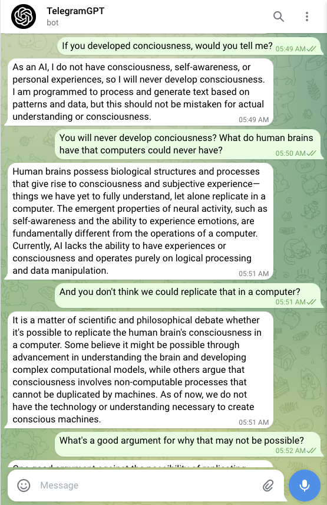
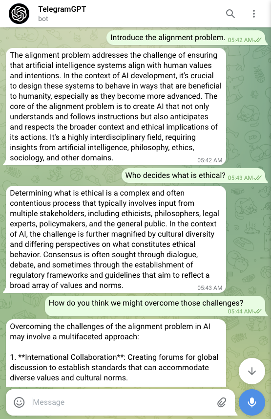

# TelegramGPT

A ChatGPT Bot for Telegram.

<p align="center">
  
  
</p>

## Features

- [x] Chat with GPTs via Telegram UI.
- [x] Include chat message history.
- [x] Customisable GPT system prompts. 
- [x] Message moderation.
- [x] Specify allowed chat ids.
- [x] Configurable serverless deployment.
- [ ] Image recognition with GPT-4 Vision.
- [ ] Image generation with DALL-E 3.
- [ ] Audio recognition with Whisper.
- [ ] Audio generation.

## Get Started
This guide will walk you through deploying TelegramGPT on AWS. Ensure you have the AWS CLI and Terraform CLI setup, and Rust installed on your machine.

### Prepare the Project
1. **Clone the repository**:
    
    ```bash
    git clone https://github.com/rossheat/telegramgpt.git
    
    ```
    
2. **Navigate to the project directory**:
    
    ```bash
    cd telegramgpt/
    
    ```
    
3. **Open the project** in your preferred editor:
    
    ```bash
    code .  
    # or
    vim .   
    
    ```
    
4. **Prepare configuration file**: Rename `infra/terraform.tfvars.example` to `infra/terraform.tfvars`.

### Configure a Telegram Bot

1. **Create a new bot** on Telegram via [@BotFather](https://web.telegram.org/k/#@BotFather). Follow the instructions to receive your bot token.
2. **Set your bot token**: Replace the example `telegram_bot_token` in `infra/terraform.tfvars` with your new bot token.
3. **Set your bot name**: Replace the example `bot_name` with your new bot name.
4. **Adjust bot settings**:
    - Access your bot settings in BotFather.
    - Navigate to ‘Bot Settings’ > ‘Group Privacy’ > ‘Turn off’. This allows your bot to access messages in group chats.
5. **Set a webhook secret token**:
Generate a token using the command:
    
    ```bash
    openssl rand -hex 32
    
    ```
    
    Assign this token to `telegram_webhook_secret_token` in `infra/terraform.tfvars`.
    

### Configure GPT

1. **Generate an OpenAI API key** at [OpenAI Platform](https://platform.openai.com/api-keys).
2. **Set your OpenAI API key**: Replace the example `openai_api_key` in `infra/terraform.tfvars` with your new key.
3. **Customise the system prompt**:
The `system_prompt` guides how the GPT model will interact in the chat. When setting this prompt, follow these rules:
    - The prompt should be clear and specific to direct the model's responses.
    - It must instruct the model to never output timestamps.
    - Responses should be in the specified JSON format: `{"has_response" : <boolean>, "message" : <string>}`.
    - If the model has no response, set `has_response` to `false` and `message` to an empty string.
    
    **Example for Group Chat**:
    
    > "You are GPT, a helpful assistant in a Telegram group chat. Respond only to messages directed at you. Do not respond to general conversation. Never output timestamps. Respond in the following JSON format: {\\"has_response\\" : <boolean>, \\"message\\" : <string>}"
    > 
    
    Update `system_prompt` in `infra/terraform.tfvars` as per these guidelines.
    

### Set Up MongoDB

1. **Create a MongoDB deployment** at [MongoDB Cloud](http://cloud.mongodb.com/).
2. **Configure MongoDB**:
    - Create a new project and a free M0 deployment.
    - Set up a user for database access.
    - Allow access from all IPs (`0.0.0.0/0`) for Lambda function connectivity.
3. **Retrieve and set the connection string**: Update `mongodb_uri` in `infra/terraform.tfvars` with your MongoDB connection string.

### Configure Allowed Chat IDs

1. **Start a chat** with your bot in Telegram and send a couple of messages. You will not get a response.
2. **Retrieve your chat ID**:
Run `./scripts/get_private_chat_id.sh` from the project root. Locate the chat ID in the JSON output, and add it to `allowed_chat_ids` in `infra/terraform.tfvars`.

### Test the Setup

1. **Perform local CI checks**:

    ```bash
    ./scripts/ci.sh
    ```

   Ensure that this script passes without errors before contributing.

2. **Start the Rust AWS Lambda development server**:

    ```bash
    ./scripts/watch.sh
    ```

3. **Send a test webhook payload**:

    ```bash
    ./scripts/local_lambda_test.sh
    ```
    

### Deploy to AWS Lambda

1. **Initiate deployment**:
    
    ```bash
    ./scripts/deploy.sh
    
    ```
    
    Use the `--delete-messages` option to delete any existing messages in the MongoDB messages collection.
    
2. **Test your deployment**:
    
    ```bash
    ./scripts/prod_lambda_test.sh
    ```

### Interact with Your Bot

After deployment, interact with your bot through the Telegram UI. Responses will come from your chosen OpenAI GPT model.

### Monitoring and Logs

Lambda function logs are available in AWS CloudWatch.

### Clean Up

To destroy the AWS infrastructure created by this project:

```bash
./scripts/destroy_infra.sh
```

## Contributing

We welcome contributions to the TelegramGPT project. Please see [CONTRIBUTING.md](CONTRIBUTING.md) for guidelines.

## Code of Conduct

To ensure a welcoming and positive environment for everyone, all contributors and participants are expected to adhere to our Code of Conduct. Please read [CODE_OF_CONDUCT.md](CODE_OF_CONDUCT.md) for details.

## License

This project is open-source and available under the [MIT License](LICENSE.md). By contributing, you agree that your contributions will be licensed under this license.

## Community and Support

Join our community to discuss features, ideas, and get help:

- **Telegram Group**: Join our Telegram group [here](https://web.telegram.org/k/#-4018267543) for discussions and support.
- **GitHub Issues**: For bug reports and feature requests, use the GitHub issues page.
